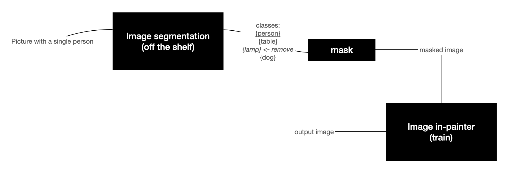

# Overview

# Image segmentation model

 - For image segmentation we have used the pre-trained mask RCNN model from https://github.com/open-mmlab/mmdetection.git.
 - The dataset was trained on COCO dataset which can indetify and provide instance segmentations for 80 different categories of objects.
 - The [instance_segmentation](https://github.com/insoochung/bg_obj_remover/blob/main/notebooks/instance_segmentation.ipynb) notebook provides the entire workflow to identify different objects and generates the masks for the selected object.

# Image in-painting model

We have to train this.

- [DeepFill v1, v2](https://mmediting.readthedocs.io/en/v0.12.0/inpainting_models.html)
- [PConv](https://github.com/MathiasGruber/PConv-Keras)
  - [Origial paper](https://arxiv.org/pdf/1804.07723v2.pdf)
  - [PConv layer explained](https://towardsdatascience.com/pushing-the-limits-of-deep-image-inpainting-using-partial-convolutions-ed5520775ab4)
  - Keeps track of mask (1 if valid pixel is involved in convlution op, 0 otherwise)
  - Per-pixel loss (hole/valid)
  - Perceptual loss (VGG loss) - should have similar rep. as vgg16 (pool1, pool2, pool3 only)
  - Style loss - utilizes VGG16 generated gram matrix.
  - Total variation loss: ensures smoothness
- [Image in-painting tutorial](https://wandb.ai/ayush-thakur/image-impainting/reports/An-Introduction-to-Image-Inpainting-Using-Deep-Learning--Vmlldzo3NDU0Nw)

# Roles

- Setup image segmentation
  - Inference: Alekhya
- Setup image inpainting
  - Train: Jiyoon
  - Inference: Insoo
